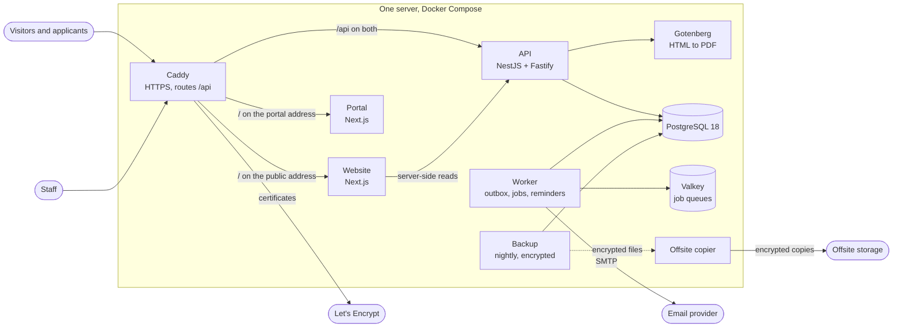
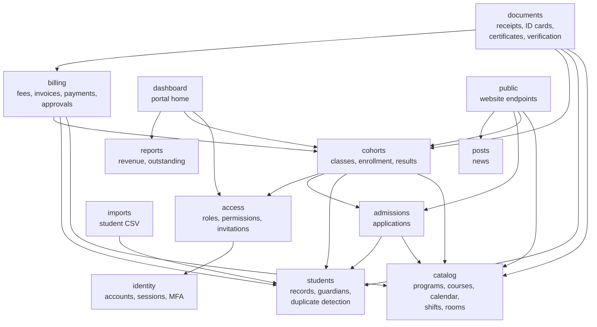
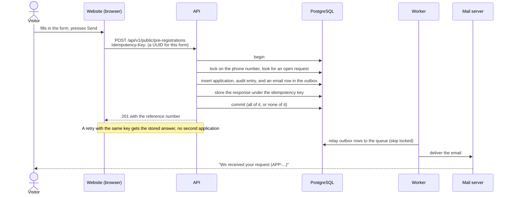
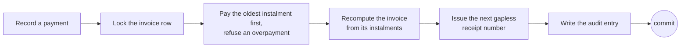

# Architecture

How EMIS fits together, in four pictures. The decisions behind them, and what was given up, are in the
[architecture decision records](adr/README.md).

## The running system

One institution, one server. Caddy is the only thing exposed to the internet.

Only Caddy and the worker can reach the internet (Caddy for certificates, the worker for email), and the offsite copier for
the backups; the API, the two sites, the database, the queue and the PDF service cannot. See [ADR 0011](adr/0011-deployment-and-recovery.md).

## The API's modules

The API is one deployable made of modules with enforced boundaries: a module may import another only through its public
`index.ts` (checked by `pnpm deps:check` in CI). Arrows mean "uses". Every module also uses **audit** (an append-only,
hash-chained log written in the same transaction as the change) and **settings** (institution profile, branches,
departments, module switches, numbering); those arrows are left out to keep the picture readable.

Inside each module the same four folders keep the layers apart: `domain/` (pure rules, no framework or database),
`application/` (services that run in transactions), `infrastructure/` (adapters such as the PDF renderer) and
`interface/` (HTTP controllers that validate with the shared Zod contracts and declare the access rule).

## What happens when someone pre-registers

Nothing in a web request sends an email or talks to another system. It writes to the database, and the worker delivers
afterwards. That is what makes a retry, a crash or a double-click safe.

## Money

A payment touches four things that must always agree, so they change together under one row lock.

Recorded money is never edited: the database role the API uses cannot delete or truncate it, and triggers refuse changes to
an amount, number or line item. A mistake is corrected by voiding (which needs a second person) and the void keeps the
receipt number it used. See [ADR 0007](adr/0007-money-and-immutable-records.md).
